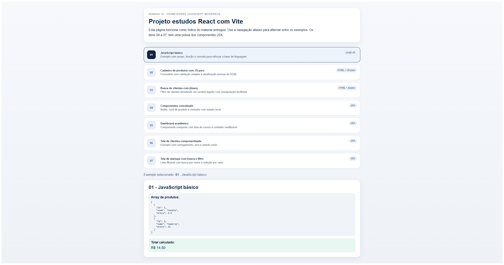

# Projeto estudos React com Vite

<p align="center"></p>


## Projeto de entrega da Semana 10 - Frameworks JavaScript Modernos.

O repositório foi organizado na infraestrutura padrão do Vite: a aplicação React fica em `src/`, os exemplos estáticos ficam em `public/` e a página principal funciona como índice visual do material.

## Como executar

1. Instale as dependências do projeto:

   ```bash
   npm install
   ```

2. Inicie o servidor de desenvolvimento do Vite:

   ```bash
   npm run dev
   Ou 
   npx vite --port=5173 # para garantir que não haja conflito de porta 
   ```

## Tecnologias utilizadas

- JavaScript ES6+
- jQuery no exemplo legado
- React nos exemplos em JSX
- Vite como ambiente de desenvolvimento
  
## Estrutura entregu

```

estudo-react-vite-frameworks-js/
├─ dist/
│  ├─ 01-javascript-basico/
│  │  └─ script.js
│  ├─ 02-cadastro-produtos-js-puro/
│  │  └─ index.html
│  ├─ 03-busca-clientes-jquery/
│  │  └─ index.html
│  ├─ assets/
│  │  ├─ index-Bhfe2Kkk.js
│  │  └─ index-CsxfTubl.css
│  └─ index.html
├─ images/
│  └─ project.png
├─ public/
│  ├─ 01-javascript-basico/
│  │  └─ script.js
│  ├─ 02-cadastro-produtos-js-puro/
│  │  └─ index.html
│  └─ 03-busca-clientes-jquery/
│     └─ index.html
├─ src/
│  ├─ components/
│  │  ├─ 04-componentes-conceituais/
│  │  │  ├─ BotaoSalvar.css
│  │  │  ├─ BotaoSalvar.jsx
│  │  │  ├─ CardProduto.css
│  │  │  ├─ CardProduto.jsx
│  │  │  ├─ Contador.css
│  │  │  └─ Contador.jsx
│  │  ├─ 05-dashboard-academico/
│  │  │  ├─ DashboardAluno.css
│  │  │  └─ DashboardAluno.jsx
│  │  ├─ 06-tela-clientes-componentizada/
│  │  │  ├─ TelaClientes.css
│  │  │  └─ TelaClientes.jsx
│  │  └─ 07-startups-componentizado/
│  │     ├─ TelaStartups.css
│  │     └─ TelaStartups.jsx
│  ├─ constants/
│  │  ├─ colors.js
│  │  ├─ sizes.js
│  │  └─ styles.js
│  ├─ data/
│  │  └─ mockData.js
│  ├─ styles/
│  │  ├─ shared.css
│  │  └─ variables.css
│  ├─ App.jsx
│  └─ main.jsx
├─ .gitignore
├─ index.html
├─ LICENSE
├─ package-lock.json
├─ package.json
├─ README.md
└─ vite.config.js

```


## Respostas da atividade

### 1. Diferença entre JavaScript puro, jQuery e componentes

JavaScript puro trabalha diretamente com a API nativa do navegador e deixa a lógica mais explícita. jQuery simplifica o DOM e foi muito útil em sistemas legados. Componentes em React utilizam a interface em partes reutilizáveis, com estado e props, o que melhora a manutenção em sistemas maiores.

### 2. Exemplo mais fácil de entender

O exemplo de JavaScript puro e o cadastro de produtos foram os mais simples de acompanhar, porque mostram claramente a sequência evento, validação, atualização do estado e renderização da interface.

### 3. Exemplo mais organizado para um sistema maior

A abordagem baseada em componentes é a mais organizada para sistemas grandes, porque separa responsabilidades, favorece reuso e deixa o código mais previsível.

### 4. O que é um componente

Componente é uma unidade independente de interface que recebe dados, pode ter comportamento próprio e pode ser combinada com outros componentes.

### 5. O que é estado em uma interface

Estado é o conjunto de dados que determina o que aparece na tela em um momento específico. Quando o estado muda, a interface deve refletir essa mudança.

## Observações

- Os exemplos React foram movidos para `src/components` para seguir a organização do Vite.
- Os exemplos estáticos foram colocados em `public/` para manter os caminhos diretos.
